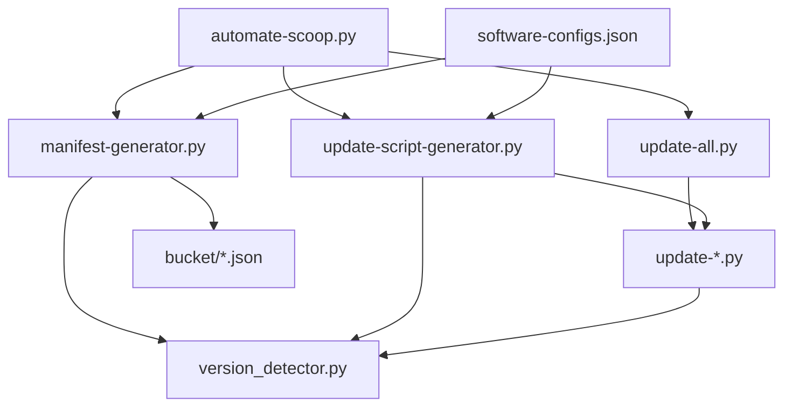

# 🐍 Scripts Technical Reference

> **Technical documentation for developers working with the automation scripts**

This document provides technical details about classes, functions, and integration patterns for developers who need to understand or modify the automation system internals.

## 📁 Script Architecture Overview

```
📁 scripts/
├── 🎯 automate-scoop.py          # Main orchestrator & CLI interface
├── 📋 manifest-generator.py      # Generates Scoop JSON manifests
├── 🔍 version_detector.py        # Shared version detection utilities
├── 🔧 update-script-generator.py # Generates Python update scripts
├── 🚀 update-all.py             # Unified script runner & orchestrator
├── 📄 update_script_template.py  # Template for generated scripts
├── ⚙️ software-configs.json     # Software definitions (temporary)
└── 📦 update-*.py              # Generated update scripts (per package)
```

## 🎯 Core Automation Scripts

### 1. `automate-scoop.py` - Main Orchestrator

**Purpose**: Primary CLI interface for the entire automation system.

**Key Features**:
- 🧙‍♂️ **Interactive Wizard**: Step-by-step software configuration
- 🔄 **Manifest Generation**: Creates Scoop JSON manifests
- 📝 **Script Generation**: Generates Python update scripts
- 🧪 **Testing & Validation**: Comprehensive test suite
- 🔍 **Auto-Discovery**: Finds software configurations automatically


**Key Classes**:
- `SoftwareConfig`: Data structure for software configuration
- `ConfigurationWizard`: Interactive configuration creation
- `ScoopAutomation`: Main automation orchestrator

### 2. `manifest-generator.py` - Manifest Creator

**Purpose**: Generates Scoop JSON manifests from software configurations.

**Key Features**:
- 🔍 **Version Detection**: Automatically detects latest versions
- 📦 **URL Construction**: Builds download URLs from templates
- 🔐 **Hash Calculation**: Computes SHA256 hashes for files
- 🔄 **Shared Session**: Reuses HTTP connections for efficiency
- ⚡ **Fallback Logic**: Legacy method when shared detection fails


**Key Classes**:
- `ManifestGenerator`: Main manifest generation logic
- Uses `VersionDetector` from `version_detector.py`
- Integrates with `SoftwareConfig` and `SoftwareVersionConfig`

**Process Flow**:
1. Load software configurations from `software-configs.json`
2. For each software:
   - Detect latest version using shared detector
   - Construct download URL from template
   - Calculate file hash
   - Generate complete Scoop manifest
   - Save to `bucket/{software}.json`

### 3. `version_detector.py` - Shared Detection Engine

**Purpose**: Provides reusable version detection and URL construction utilities.

**Key Features**:
- 🌐 **HTTP Session Management**: Persistent connections with proper headers
- 🔍 **Multi-Pattern Matching**: Tries multiple regex patterns for version detection
- 📊 **Hash Calculation**: SHA256 hash computation for downloaded files
- 🔄 **Retry Logic**: Robust error handling and retries
- 🎯 **GitHub API Support**: Special handling for GitHub releases

**Key Classes**:
- `VersionDetector`: Main detection engine with session management
- `SoftwareConfig`: Configuration data structure
- `SoftwareVersionConfig`: Version-specific configuration

**Key Functions**:
- `fetch_latest_version()`: Scrapes version from homepage
- `calculate_file_hash()`: Computes SHA256 hash
- `get_version_info()`: High-level version detection interface
- `create_software_config_from_manifest()`: Reverse-engineers config from manifest

**Usage Patterns**:
```python
from version_detector import get_version_info, SoftwareVersionConfig

# Create configuration
config = SoftwareVersionConfig(
    name="my-app",
    homepage="https://api.github.com/repos/user/repo/releases/latest",
    version_patterns=[r'"tag_name":\s*"v?([0-9]+\.[0-9]+\.[0-9]+)"'],
    download_url_template="https://github.com/user/repo/releases/download/v$version/app-$version.exe"
)

# Get version info
version_info = get_version_info(config)
print(f"Version: {version_info['version']}")
print(f"URL: {version_info['url']}")
print(f"Hash: {version_info['hash']}")
```

### 4. `update-script-generator.py` - Script Creator

**Purpose**: Generates Python update scripts for each software package.

**Key Features**:
- 📝 **Template-Based Generation**: Uses consistent script templates
- 🔍 **Pattern Extraction**: Extracts patterns from existing manifests
- 🎯 **Shared Integration**: Generated scripts use `version_detector.py`
- 🔄 **Batch Generation**: Can generate scripts for all manifests


**Generated Script Features**:
- Uses shared `version_detector.py` for consistency
- Includes dry-run mode for testing
- Proper error handling and logging
- Automatic manifest updating

**Template Structure**:
```python
#!/usr/bin/env python3
"""
{Package Name} Update Script
Automatically checks for updates and updates the Scoop manifest.
"""

import json
import sys
from pathlib import Path
from version_detector import SoftwareVersionConfig, get_version_info

# Configuration
SOFTWARE_NAME = "{software_name}"
HOMEPAGE_URL = "{homepage_url}"
DOWNLOAD_URL_TEMPLATE = "{download_url_template}"
BUCKET_FILE = Path(__file__).parent.parent / "bucket" / "{manifest_name}"

def update_manifest():
    """Update the Scoop manifest using shared version detection"""
    # Implementation using shared detector
```

### 5. `update-all.py` - Orchestrator & Runner

**Purpose**: Manages and executes all update scripts with advanced features.

**Key Features**:
- 🚀 **Parallel Execution**: Run multiple scripts simultaneously
- 🎯 **Selective Updates**: Target specific packages
- 🧪 **Dry Run Mode**: Test without making changes
- 📊 **Progress Tracking**: Real-time status and timing
- 🔧 **Error Handling**: Graceful failure management
- 📈 **Summary Reports**: Detailed execution summaries


**Key Features**:
- **Auto-Discovery**: Automatically finds all `update-*.py` scripts
- **Dependency Checking**: Validates Python and required modules
- **Unicode Handling**: Proper encoding for international characters
- **Timeout Management**: Prevents hanging scripts
- **Result Tracking**: Success/failure statistics

**Output Example**:
```
🔧 Scoop Bucket Update Orchestrator
📅 Started at: 2024-01-15 14:30:00
🎯 Mode: Sequential
⏱️  Timeout: 300s per script
📋 Scripts to run (4):
   • corecycler
   • ungoogled-chromium
   • hdd-lff-portable
   • usb-safely-remove

🚀 Running update-corecycler.py...
✅ update-corecycler.py - Updated successfully (12.3s)

🚀 Running update-ungoogled-chromium.py...
✅ update-ungoogled-chromium.py - No update needed (5.1s)

📊 Summary (Total: 45.2s)
✅ Successful: 3
⚠️  No updates: 1
❌ Failed: 0
```

## 📦 Generated Update Scripts

### Pattern: `update-{software}.py`

Each software package gets its own update script following a consistent pattern:

### Update Script Patterns

#### Template-Based Generation
All update scripts are generated from `update_script_template.py`, which provides:
- Standardized structure and error handling
- Integration with `version_detector.py` for shared logic
- Consistent logging and output formatting
- Unified manifest updating process

#### Common Script Structure
Each generated update script contains:

1. **Header and Imports**
   ```python
   #!/usr/bin/env python3
   """
   {Software Name} Update Script
   Automatically checks for updates and updates the Scoop manifest.
   """
   import json, re, requests, hashlib, subprocess
   from pathlib import Path
   from typing import Optional
   ```

2. **Configuration Section**
   ```python
   HOMEPAGE_URL = "https://..."
   DOWNLOAD_URL_TEMPLATE = "https://.../$version/..."
   BUCKET_FILE = Path(__file__).parent.parent / "bucket" / "{package}.json"
   ```

3. **Updater Class**
   - `fetch_latest_version()`: Version detection using regex patterns
   - `get_download_url()`: URL construction from templates
   - `calculate_hash()`: SHA256 hash calculation
   - `update_manifest()`: JSON manifest updating

4. **Main Execution**
   - Version comparison logic
   - Update workflow orchestration
   - Error handling and status reporting

#### Version Detection Patterns
Scripts use multiple regex patterns for robust version detection:
```python
version_patterns = [
    r'([0-9]+\.[0-9]+(?:\.[0-9]+)?)',
    r'Version:?\s*([0-9]+\.[0-9]+(?:\.[0-9]+)?(?:\.[0-9]+)?)',
    r'v\.?\s*([0-9]+\.[0-9]+(?:\.[0-9]+)?(?:\.[0-9]+)?)',
    r'([0-9]+\.[0-9]+(?:\.[0-9]+)?(?:\.[0-9]+)?)\s*(?:version|release)',
]
```

#### URL Template System
Download URLs are constructed using template substitution:
- Template: `"https://github.com/user/repo/releases/download/v$version/file.zip"`
- Result: `"https://github.com/user/repo/releases/download/v1.2.3/file.zip"`

#### Error Handling
- Network timeout handling (30s default)
- HTTP status code validation
- JSON parsing error recovery
- Fallback mechanisms for URL construction

#### Integration Points
- **Discovery**: Auto-detected by `update-all.py` using glob pattern `update-*.py`
- **Orchestration**: Executed in parallel by `update-all.py`
- **Generation**: Created/updated by `update-script-generator.py`
- **Configuration**: Driven by `software-configs.json` entries

**Features of Generated Scripts**:
- ✅ **Shared Logic**: Uses `version_detector.py` for consistency
- ✅ **Dry Run Support**: Test mode without file changes
- ✅ **Error Handling**: Graceful failure with informative messages
- ✅ **Version Comparison**: Only updates when new version is available
- ✅ **Atomic Updates**: Safe file writing with backup/restore
- ✅ **Logging**: Clear status messages and progress indicators

## 🔧 Configuration System

**Configuration Schema**: The system uses `software-configs.json` with these technical fields:
- `homepage_url`: Source URL for version scraping
- `download_url_template`: Template with `{version}` placeholder
- `version_regex`: Array of regex patterns for version extraction
- `description`, `license`, `architecture`, `bin`, `shortcuts`: Manifest metadata

## 🧪 Testing & Validation

**Validation Components**:
- `test_version_detection()`: Tests regex patterns against live websites
- `validate_download_url()`: Verifies URL accessibility
- `verify_file_hash()`: Confirms file integrity
- `validate_manifest_syntax()`: Validates JSON structure
- `check_dependencies()`: Ensures required fields are present

## 🔄 Integration Patterns

### Script Interdependencies



### Data Flow

1. **Configuration**: `software-configs.json` defines software rules
2. **Generation**: Scripts read config and generate manifests + update scripts
3. **Execution**: Update scripts use shared detector for version checking
4. **Orchestration**: `update-all.py` manages execution of all update scripts
5. **Output**: Updated manifests in `bucket/` directory

### Error Handling Strategy

**Graceful Degradation**:
- Shared detection fails → Fall back to legacy method
- Network errors → Retry with exponential backoff
- Invalid regex → Try alternative patterns
- Missing files → Skip with warning, continue with others

**Logging Levels**:
- 🔍 **Info**: Normal operation status
- ⚠️ **Warning**: Non-fatal issues (fallbacks, skips)
- ❌ **Error**: Fatal issues that stop processing
- ✅ **Success**: Completed operations

## 🚀 Performance Optimizations

### HTTP Session Reuse
- Single session per `VersionDetector` instance
- Connection pooling for multiple requests
- Proper User-Agent headers to avoid blocking

### Parallel Processing
- `update-all.py` supports parallel execution
- Configurable worker count
- Timeout management per script

### Caching Strategies
- HTTP session keeps connections alive
- Manifest comparison prevents unnecessary updates
- Hash calculation only when needed

## 📈 Monitoring & Maintenance

### Log Analysis
Scripts provide structured output for monitoring:
```
🔍 Scraping version from: https://api.github.com/repos/user/repo/releases/latest
✅ Found version: 1.2.3
📦 Download URL: https://example.com/download/v1.2.3/app-1.2.3.exe
🔍 Calculating hash...
✅ Hash: sha256:abc123...
💾 Saved manifest: bucket/app.json
✅ Successfully generated manifest for app
```

### Health Checks
- URL accessibility validation
- Hash integrity verification
- Manifest syntax validation
- Update script functionality testing

### Automation Maintenance
- Regular dependency updates
- Pattern validation for new software
- Performance monitoring
- Error rate tracking

---

## 🎯 Quick Reference

### Most Common Commands
```bash
# Start with the wizard
python scripts/automate-scoop.py wizard

# Generate everything
python scripts/automate-scoop.py generate-all

# Run all updates (parallel by default)
python scripts/update-all.py

# Common orchestrator flags:
python scripts/update-all.py --workers 6
python scripts/update-all.py --sequential
python scripts/update-all.py --fast
python scripts/update-all.py --retry 2
python scripts/update-all.py --structured-output
python scripts/update-all.py --http-cache --http-cache-ttl 1800

# Test the system
python scripts/automate-scoop.py test
```

### Structured Output Schema
- Scripts should emit a single JSON object per run for orchestrator consumption.
- Fields:
  - `updated` (bool): whether a manifest was updated
  - `name` (string): software name
  - `version` (string, optional): detected or current version
  - `error` (string, optional): error code when the update failed
- Examples:
```json
{"updated": true, "name": "Example App", "version": "1.2.3"}
```
```json
{"updated": false, "name": "Example App", "version": "1.2.3", "error": "save_failed"}
```
- The orchestrator will prefer JSON when `--structured-output` is set; otherwise it falls back to text heuristics.

### File Locations
- **Configurations**: `scripts/software-configs.json` (temporary)
- **Generated Manifests**: `bucket/*.json`
- **Generated Scripts**: `scripts/update-*.py`
- **Core Modules**: `scripts/{automate-scoop,manifest-generator,version_detector}.py`

### Key Integration Points
- All scripts use `version_detector.py` for consistency
- `automate-scoop.py` orchestrates the entire workflow
- `update-all.py` manages execution of generated scripts
- Configuration flows from JSON → Manifests + Scripts → Execution
