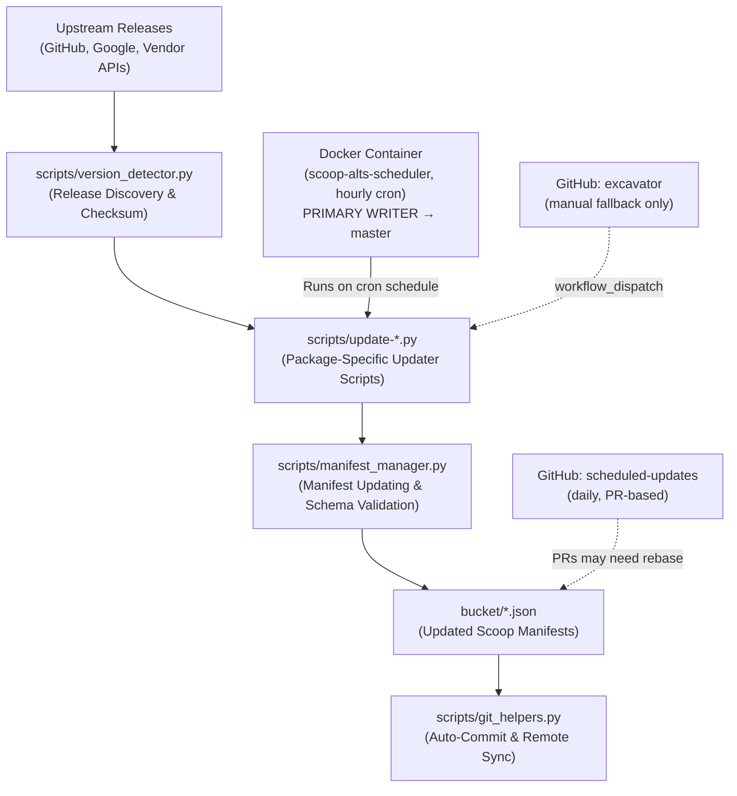

# Dan's Alternative Scoop Bucket (`scoop-alts`)

[](https://github.com/danalec/scoop-alts/actions/workflows/python-ci.yml)
[](bucket/)
[](https://scoop.sh)
[](LICENSE)
[](https://www.python.org/)

Scoop smoke test: daily install observability ([workflow](.github/workflows/scoop-smoke.yml)).

> Curated Windows software manifests with enhanced packaging, automated quality assurance, and intelligent lifecycle management for [Scoop](https://scoop.sh).

`scoop-alts` is an alternative bucket providing software with enhanced configurations, customized persistence rules, Widevine DRM integrations, and bleeding-edge builds. Every manifest is tracked and validated continuously through a Python-based automation pipeline and a dedicated containerized scheduler. A generated package index is published to <https://danalec.github.io/scoop-alts/> via GitHub Pages.

---

## 🌟 Featured Applications

| Package | Category | Highlights & Special Features |
| :--- | :--- | :--- |
| **`ungoogled-chromium`** | Browser / Privacy | Includes Widevine DRM support for Spotify & Netflix, persisted user profile across updates, and optional default-browser configuration. |
| **`thorium-avx2`** | Browser / Performance | Optimized AVX2-accelerated Chromium fork tracking upstream releases with portable ZIP extraction layout. |
| **`agy`** | Developer / AI | Official **Antigravity CLI** by Google DeepMind. Multi-architecture support (`64bit` AMD64 and `arm64`) with automated upstream artifact tracking. |
| **`taskexplorer`** | Utilities / System | Advanced process monitor and system inspector with thread, handle, network, and memory analysis. |
| **`windhawk`** | Customization | Modular Windows modification engine with persistent configuration and mod directories across updates. |
| **`corecycler`** | Benchmarking | Automated per-core CPU stress testing tool for fine-tuning Curve Optimizer on modern AMD Ryzen and Intel processors. |
| **`usb-safely-remove-portable`** | Hardware / USB | Portable edition of the USB device manager with redirect-aware updater and clean state preservation. |

---

## 📦 Complete Package Catalog (23 Packages)

| Manifest | Upstream Provider | Description | Persist Support |
| :--- | :--- | :--- | :---: |
| [`agy`](bucket/agy.json) | Google Cloud | Antigravity CLI — Agentic AI coding assistant by Google DeepMind | — |
| [`atomic`](bucket/atomic.json) | GitHub Releases | High-performance alarm and event monitoring client | — |
| [`cache-relocator`](bucket/cache-relocator.json) | SoftPerfect | Move browser and application caches to RAM disk or secondary storage | — |
| [`chromium-crlset`](bucket/chromium-crlset.json) | Google Chrome | Latest Certificate Revocation List (CRLSet) updates for Chromium | — |
| [`codecharta`](bucket/codecharta.json) | GitHub Releases | Code analysis and interactive 3D city visualization tool | — |
| [`corecycler`](bucket/corecycler.json) | GitHub Releases | Script-driven per-core stability tester using Prime95/Y-Cruncher | — |
| [`depressurizer`](bucket/depressurizer.json) | GitHub Releases | Steam library categorization and auto-tagging utility | — |
| [`esptool`](bucket/esptool.json) | GitHub Releases | ROM bootloader utility for Espressif ESP8266 & ESP32 chips | — |
| [`hdd-lff-portable`](bucket/hdd-lff-portable.json) | HDDGuru | Low-level formatting tool for SATA, IDE, SAS, SCSI, and SSD drives | — |
| [`ntoptimizer`](bucket/ntoptimizer.json) | NTDev | Lightweight Windows performance tuning and debloating utility | — |
| [`ripgrep-all`](bucket/ripgrep-all.json) | [danalec/ripgrep-all](https://github.com/danalec/ripgrep-all) | Ripgrep wrapper searching inside PDFs, E-books, Office files (incl. legacy .doc/.rtf), and archives | — |
| [`taskexplorer`](bucket/taskexplorer.json) | GitHub Releases | Advanced task manager and security tool with driver-level inspection | — |
| [`thorium-avx2`](bucket/thorium-avx2.json) | GitHub Releases | Fastest Chromium fork with compiler optimizations for AVX2 CPUs | `USER_DATA` |
| [`ungoogled-chromium`](bucket/ungoogled-chromium.json) | GitHub Releases | Google-free Chromium with Widevine DRM integration | `User Data` |
| [`unraid-usb-creator`](bucket/unraid-usb-creator.json) | LimeTech | Official Lime Technology tool to prepare bootable Unraid OS flash drives | — |
| [`usb-safely-remove`](bucket/usb-safely-remove.json) | SafelyRemove | Enhanced USB device management and quick eject utility (Installer) | — |
| [`usb-safely-remove-portable`](bucket/usb-safely-remove-portable.json) | SafelyRemove | Portable edition of USB Safely Remove with self-contained settings | — |
| [`veracrypt`](bucket/veracrypt.json) | IDRIX | Open-source on-the-fly disk encryption software | — |
| [`victoria`](bucket/victoria.json) | Direct Asset | Comprehensive HDD/SSD diagnostic, testing, and surface analysis tool | — |
| [`widevinecdm`](bucket/widevinecdm.json) | Google Chrome | Widevine Content Decryption Module for third-party Chromium builds | — |
| [`wifiscanner`](bucket/wifiscanner.json) | LizardSystems | 802.11a/b/g/n/ac/ax wireless network scanner and spectrum analyzer | — |
| [`windhawk`](bucket/windhawk.json) | GitHub Releases | Customization engine for Windows programs using modular injectables | `AppData` |
| [`zapfast`](bucket/zapfast.json) | [crmne/zapfast](https://github.com/crmne/zapfast) | Fast, native WhatsApp client in Rust and egui | — |

---

## 🚀 Quick Start

### 1. Add the Bucket to Scoop

Open PowerShell and run:

```powershell
scoop bucket add danalec_scoop-alts https://github.com/danalec/scoop-alts
```

### 2. Install Packages

```powershell
# Antigravity CLI (Google DeepMind)
scoop install danalec_scoop-alts/agy

# Privacy-hardened browser with Widevine DRM
scoop install danalec_scoop-alts/ungoogled-chromium

# High-performance AVX2 browser
scoop install danalec_scoop-alts/thorium-avx2

# Windows diagnostic and customization tools
scoop install danalec_scoop-alts/taskexplorer
scoop install danalec_scoop-alts/windhawk
```

### 3. Updating Installed Packages

```powershell
scoop update
scoop update danalec_scoop-alts/agy
```

---

## 💡 Package-Specific Guides

### Ungoogled Chromium

`ungoogled-chromium` includes custom extensions to support proprietary DRM media playback and user profile preservation:

* **Widevine DRM**: Automatically deploys the compatible `WidevineCdm` module for Spotify, Netflix, and Disney+ web streaming.
* **Persistent Profile**: Preserves user profiles across Scoop updates at `%USERPROFILE%\scoop\persist\ungoogled-chromium\User Data`.
* **Clean Purge**: To remove all stored profile data on uninstall, pass `--purge`:

  ```powershell
  scoop uninstall ungoogled-chromium --purge
  ```

📖 *For full details on registry associations, migration from older installations, and default browser settings, see [docs/ungoogled-chromium.md](docs/ungoogled-chromium.md).*

### Windhawk

* **Persisted Path**: `%USERPROFILE%\scoop\persist\windhawk\windhawk\AppData`
* **Clean Uninstall**: `scoop uninstall windhawk --purge`

---

## 🤖 Automation Architecture

The repository maintains zero-toil manifest freshness through a modular Python automation engine.
The Docker container cron (hourly, direct push to `master`) is the single automatic writer to `master`. The GitHub `scheduled-updates` workflow opens PRs daily and may need a rebase when the container cron touched the same manifests in the meantime; the `excavator` workflow is manual-only.



### Running the Orchestrator Manually

To run all package updaters concurrently:

```bash
# Install automation dependencies
pip install -r scripts/requirements-automation.txt

# Execute all updaters in parallel with structured output
python scripts/update-all.py --workers 6 --structured-output
```

Common runtime options:

* `--sequential`: Run updaters one by one (useful for debugging).
* `--only-providers github`: Update only packages hosted on GitHub.
* `--retry 2`: Retry transient network failures.
* `--json-summary .temp/summary.json`: Export machine-readable execution report.
* `--force`: Re-run updaters even when versions are unchanged (propagated to child scripts via `FORCE=1`). Individual updaters also honor `SCOOP_FORCE=1`, `--force` / `-f`, or the legacy `forcedly` spelling.

### Forced Updates

Normally an updater skips a manifest whose version already matches upstream. A **forced update** rewrites the manifest anyway — useful to refresh hashes or URLs for an unchanged version. Force mode is triggered by:

* `python scripts/update-all.py --force` — exports `FORCE=1` so every child updater runs forced.
* `FORCE=1` or `SCOOP_FORCE=1` in the environment of a single updater script.
* `--force` / `-f` / `--forcedly` / `forcedly` on an updater script's command line.

Under the hood, `scripts/manifest_manager.py` exposes `is_forced()` for detection and `ManifestUpdater` accepts a `force=` argument, so updater scripts only need `force=is_forced()` (see `scripts/update-ripgrep-all.py` for the reference implementation).

---

## 🐳 Containerized Deployment (Docker Scheduler)

This bucket includes a production-ready Docker container that automatically runs the update orchestrator on a scheduled cron:

* **Compose File**: [`docker-compose.yml`](docker-compose.yml)
* **Guide**: [docs/DOCKER-SETUP.md](docs/DOCKER-SETUP.md)

```bash
# Start the update scheduler in background
docker compose up -d
```

---

## 📁 Repository Structure

```text
scoop-alts/
├── .github/
│   └── workflows/          # GitHub Actions CI for manifest & python validation
├── bin/                    # Utility migration PowerShell scripts
├── bucket/                 # Scoop JSON package manifests (22 packages)
├── docker/                 # Production Docker scheduler configurations & scripts
│   └── bin/                # Entrypoints, healthchecks, and runners
├── docs/                   # In-depth technical guides and documentation
│   ├── index.md            # Master documentation index
│   ├── AUTOMATION-GUIDE.md # Getting started with bucket automation
│   ├── AUTOMATION-SCRIPTS-DOCUMENTATION.md # Architecture & module reference
│   ├── AUTOMATION-ADVANCED.md # Advanced CI, throttling, and custom scripts
│   ├── DOCKER-SETUP.md     # Containerized scheduler deployment guide
│   └── ungoogled-chromium.md # Detailed guide for Ungoogled Chromium
├── scripts/                # Python automation framework & package updaters
│   ├── update-all.py       # Orchestrator runner for all package updaters
│   ├── version_detector.py # Upstream version discovery and hash computation
│   ├── manifest_manager.py # Scoop manifest schema mutation & validation
│   ├── git_helpers.py      # Git automation, staging, and commit handling
│   ├── providers.json      # Provider classification map for rate throttling
│   └── update-*.py         # Package-specific updater implementations
├── tests/                  # Unit and integration test suite
├── Dockerfile              # Dockerfile for headless cron runner
├── docker-compose.yml      # Compose specification for update scheduler
├── CONTRIBUTING.md         # Contribution guidelines
├── LICENSE                 # BSD 3-Clause License
└── README.md               # Primary project documentation
```

---

## 📚 Master Documentation Index

All extended documentation is organized under [`docs/`](docs/):

* [Master Documentation Sitemap (`docs/index.md`)](docs/index.md)
* [Automation Getting Started Guide (`docs/AUTOMATION-GUIDE.md`)](docs/AUTOMATION-GUIDE.md)
* [Automation Technical Reference (`docs/AUTOMATION-SCRIPTS-DOCUMENTATION.md`)](docs/AUTOMATION-SCRIPTS-DOCUMENTATION.md)
* [Advanced Automation & Throttling (`docs/AUTOMATION-ADVANCED.md`)](docs/AUTOMATION-ADVANCED.md)
* [Containerized Scheduler Deployment (`docs/DOCKER-SETUP.md`)](docs/DOCKER-SETUP.md)
* [Ungoogled Chromium Configuration (`docs/ungoogled-chromium.md`)](docs/ungoogled-chromium.md)

---

## 🤝 Contributing

Contributions are welcome! Please follow these standards:

1. Ensure all manifests validate against the schema: `python scripts/automate-scoop.py validate`.
2. Follow Conventional Commits format (`feat(bucket): add <package>`, `fix(scripts): resolve hash computation`).
3. Keep all documentation, comments, and commit messages in English.

See [CONTRIBUTING.md](CONTRIBUTING.md) for full developer guidelines.

---

## 📄 License

This repository is licensed under the [BSD-3-Clause License](LICENSE).
Individual software packages installed via these manifests are governed by their respective upstream licenses.
